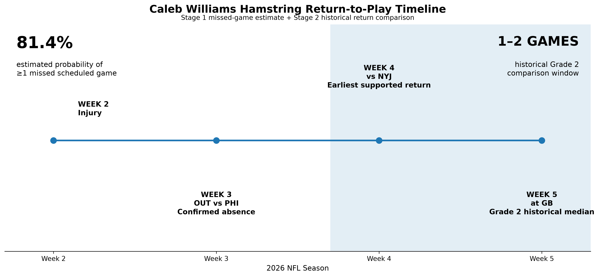

# Caleb Williams Hamstring Return-to-Play Analysis

## Project Overview

This project evaluates the return-to-play timeline for Caleb Williams following a Grade 2 right hamstring strain during the 2026 NFL season.

Rather than predicting an exact return date, I developed a two stage analytical framework using historical NFL quarterback hamstring injuries.

### Stage 1 — Will the Injury Cause a Missed Game?

I trained a regularized logistic regression model using historical quarterback hamstring episodes and pre-injury information available at injury onset.

The model estimated an **81.4% probability that Caleb's injury would result in at least one missed scheduled game**.

Caleb was subsequently ruled out for Chicago's Week 3 game against Philadelphia, allowing the Stage 1 estimate to be compared with an observed outcome.

### Stage 2 — How Long Could the Absence Last?

I then analyzed historical quarterback hamstring injuries with observed returns to play.

Across the full observed-return cohort:

- Median absence: **1 game**
- Historical range: **1–5 games**

Among the smaller group of documented **Grade 2 / moderate hamstring injuries**:

- Cases: **3**
- Median absence: **2 games**
- Observed range: **1–2 games**

Mapped onto Chicago's 2026 schedule, the historical evidence supports a potential return window of:

**Week 4 vs. NYJ → Week 5 at GB**

This window should be interpreted as an exploratory historical estimate rather than a clinical prognosis or a probability of returning in a specific week.
## Return-to-Play Timeline



## Methodology

### Data Collection

Historical NFL quarterback hamstring injury reports were combined with player statistics and NFL schedule data to construct individual injury episodes. Each episode was linked to scheduled games and player participation to determine whether the quarterback missed a game and, when observable, when the player returned.

The analysis was divided into two stages to separate two different questions:

1. **Stage 1:** Will the hamstring injury result in at least one missed scheduled game?
2. **Stage 2:** If games are missed, what return-to-play window is supported by comparable historical cases?

### Stage 1 — Missed-Game Classification

Stage 1 used a regularized logistic regression model with three features available at or before injury onset:

- Initial injury-report designation (`Out/Doubtful` vs. other)
- Number of prior observable NFL hamstring episodes
- Average quarterback workload over available games immediately preceding the injury (`pass attempts + carries`)

The model was evaluated using **leave-one-player-out cross-validation (LOPO)** so that episodes belonging to the same quarterback were not used simultaneously for training and validation.

The finalized model was then fit to the historical cohort and applied to Caleb Williams' pre-injury information.

**Model estimate: 81.4% probability of missing at least one scheduled game.**

### Stage 2 — Return-to-Play Analysis

Because the number of clean historical return-to-play cases was small. Stage 2 did not fit a second machine learning model. Instead, it used the observed distribution of games missed among quarterback hamstring injuries with identifiable returns to play.

Severity information was then used as a comparison layer rather than as a fitted predictor. Caleb's reported Grade 2 injury was compared with documented Grade 2 / moderate historical cases.

This produced a historically supported **1–2 missed-game window**, which was then mapped onto Chicago's 2026 schedule.

## Model Performance

Because the historical dataset contains only 24 eligible injury episodes across 23 quarterbacks, model evaluation focused on an out of sample performance while accounting for the small sample size.

The primary validation strategy was **leave-one-player-out cross-validation (LOPO)**. All episodes belonging to the held-out quarterback were excluded from training during each validation fold, reducing the risk of player-level information leaking between the training and validation sets.

| Metric | Historical Baseline | Logistic Regression (LOOCV) | Logistic Regression (LOPO) |
|---|---:|---:|---:|
| Accuracy | 0.625 | 0.667 | **0.667** |
| Balanced Accuracy | 0.500 | 0.667 | **0.667** |
| ROC-AUC | — | 0.719 | **0.711** |
| Brier Score | 0.234 | 0.215 | **0.196** |
| Log Loss | 0.662 | 0.631 | **0.556** |

### Validation Interpretation

The LOPO model improved on the historical baseline in balanced accuracy, Brier score, and log loss while producing a ROC-AUC of 0.711.

The similar performance between leave-one-out and leave-one-player-out validation also suggests that the results were not primarily driven by quarterbacks who appeared more than once in the historical dataset.

However, the sample remains small. These metrics should therefore be interpreted as evidence of model behavior within this historical cohort rather than estimates of performance across the entire NFL quarterback population.

## Limitations

This project is an exploratory sports analytics case study and has several important limitations:

- The historical quarterback hamstring cohort is small, with only **24 eligible Stage 1 episodes** and **8 clean observed-return cases** available for Stage 2.
- Only **3 historical Stage 2 cases** had documented Grade 2 / moderate severity information comparable to Caleb's reported injury.
- Historical NFL injury reports do not consistently provide injury grades, imaging findings, rehabilitation progress, or complete clinical information.
- Player participation and scheduled games were used to reconstruct missed-game outcomes, but publicly available data cannot always establish whether every absence was caused exclusively by the hamstring injury.
- Early-season injuries provide fewer pre-injury games for workload calculation. Because Caleb's injury occurred in Week 2, only his Week 1 workload was available for this feature.
- Stage 1 estimates the probability of **at least one missed scheduled game**, not the probability of missing a particular week.
- Stage 2 historical frequencies are descriptive and should not be interpreted as calibrated probabilities of Caleb returning in a particular week.
- The analysis is not a medical diagnosis or clinical return-to-play recommendation.

## Key Findings

- The historical Stage 1 cohort contained **24 eligible quarterback hamstring injury episodes**, of which **15 (62.5%) resulted in at least one missed scheduled game**.
- The finalized Stage 1 logistic regression produced an **81.4% estimated probability that Caleb Williams' injury would result in at least one missed scheduled game**.
- Caleb was subsequently ruled out for **Week 3 vs. Philadelphia**, providing an observed outcome consistent with the Stage 1 classification.
- Among the **8 historical cases with clean observed returns to play**, the median absence was **1 game**.
- Among the **3 documented Grade 2 / moderate comparison cases**, players missed **1–2 games**, with a median of **2 games**.
- Mapping that historical comparison window onto Chicago's 2026 schedule produces a potential return window of **Week 4 vs. NYJ through Week 5 at GB**.

### Bottom Line

The analysis supports a **1–2 missed-game return-to-play window**, while the Grade 2 comparison subgroup is centered on **2 games missed**. Because of the small historical sample, this should be interpreted as a data-supported range rather than a prediction of an exact return date.

## Technologies Used

- **Python**
- **pandas / NumPy** — data cleaning, feature engineering, and episode construction
- **scikit-learn** — preprocessing, logistic regression, and model validation
- **Matplotlib** — return-to-play visualization
- **Jupyter Notebook** — reproducible analysis workflow
- **nflverse** — NFL player statistics, schedules, and injury-report data
- **Git / GitHub** — version control and project documentation

## Data Sources

This project combines multiple public data sources to construct historical quarterback hamstring injury episodes and evaluate return-to-play outcomes.

### Primary Data Resources

- [nflverse](https://nflverse.nflverse.com/) — NFL analytics data ecosystem
- [nflverse-data](https://github.com/nflverse/nflverse-data) — automated NFL data releases
- [nflreadr Documentation](https://nflreadr.nflverse.com/) — documentation for nflverse datasets and data access

### NFL Data

Primary NFL data were obtained through the **nflverse** ecosystem.

Data used included:

- Weekly player statistics
- Player identifiers and team information
- NFL schedules
- Injury-report information

These datasets were used to identify quarterback hamstring injury episodes, reconstruct scheduled games, determine player participation, calculate pre-injury workload, and measure games missed before return to play.

### Injury Severity Validation

Because historical NFL injury-report data do not consistently include injury grades, publicly reported injury information was reviewed separately for severity context.

Severity information was treated as a **comparison layer rather than a model feature**. Injury grades were not inferred solely from the number of games missed.

Cases without sufficiently documented severity information were classified conservatively rather than assigned an assumed injury grade.

Severity evidence and source notes for individual historical cases are documented in:

`data/severity_validation.csv`

The validation file records the reported injury grade or severity when sufficient public evidence was available, along with the source and supporting evidence used for classification.

For the Stage 2 severity comparison, only cases with sufficiently documented severity were used. Cases without reliable severity documentation were retained as `unknown` rather than having an injury grade inferred from games missed.

## Repository Structure

```text
caleb-williams-hamstring-rtp/
│
├── data/
│   ├── raw/                     # Raw source data
│   ├── processed/               # Intermediate processed datasets
│   ├── stage1_engineered_features.csv
│   ├── stage1_validation_results.csv
│   ├── stage1_leave_one_player_out_predictions.csv
│   ├── stage2_rtp_observed.csv
│   └── caleb_williams_rtp_estimate.csv
│
├── notebooks/
│   ├── 01_data_collection.ipynb
│   ├── 02_feature_engineering.ipynb
│   ├── 03_stage1_modeling.ipynb
│   └── 04_stage2_rtp_timeline.ipynb
│
├── visualizations/
│   └── caleb_williams_rtp_timeline.png
│
└── README.md

## Analysis Workflow

**01 — Data Collection**  
Collect NFL injury reports, player statistics, and schedule data and identify quarterback hamstring injury episodes.

**02 — Feature Engineering**  
Reconstruct scheduled-game participation, determine missed-game outcomes, calculate pre-injury workload, identify prior hamstring episodes, and create the Stage 1 modeling dataset.

**03 — Stage 1 Modeling**  
Train and validate a regularized logistic regression classifier using leave-one-player-out cross-validation and estimate the probability that an injury episode results in at least one missed scheduled game.

**04 — Stage 2 Return-to-Play Analysis**  
Analyze clean observed-return cases, incorporate documented injury severity as a comparison layer, map the historical missed-game window onto Chicago's schedule, and generate the final return-to-play timeline.

## Reproducibility

The notebooks are numbered in the order in which the analysis should be reproduced:

1. `01_data_collection.ipynb`
2. `02_feature_engineering.ipynb`
3. `03_stage1_modeling.ipynb`
4. `04_stage2_rtp_timeline.ipynb`

Intermediate datasets and validation outputs are stored in the `data/` directory, while final figures are stored in `visualizations/`.

Manual injury-severity classifications and their supporting source evidence are maintained separately in `data/severity_validation.csv` so that manually reviewed information remains distinguishable from variables derived directly from NFL data.
